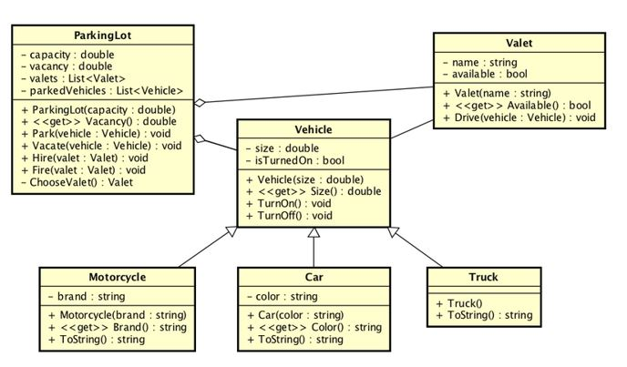
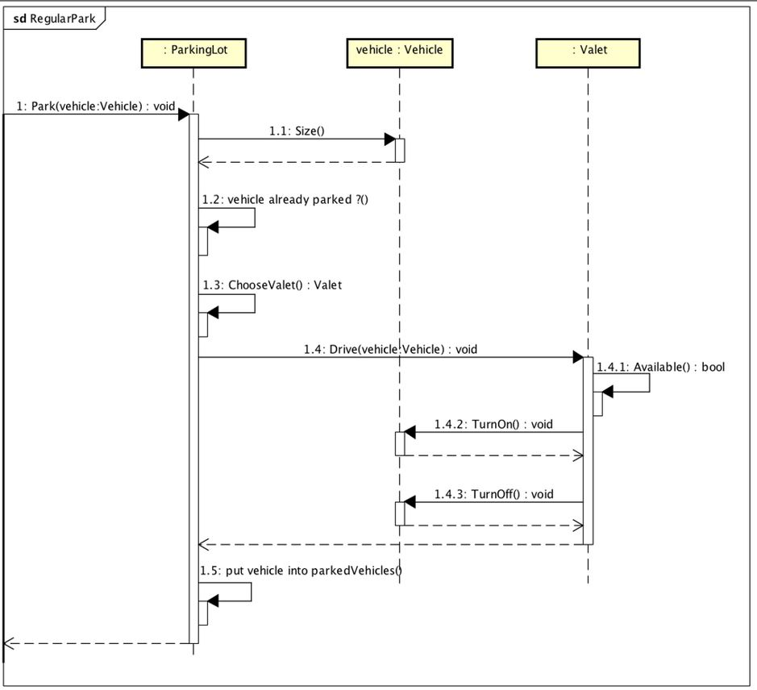

# 226b - Palace

## Sujet à traiter
Nous allons réaliser un petit projet en lien avec la gestion d'un parking exploité par un palace (hôtle de luxe).

### Prise en main du code

1)  Récupérer le dépôt

```
    git clone <url du dépôt>
```
   
2) Réaliser la première compilation. Il est important que le réseau soit disponible. Le gestionnaire de dépendences (Nguet) en a besoin pour fonctionner correctement.

```
========== Build: 2 succeeded, 0 failed, 0 up-to-date, 0 skipped ==========
========== Build completed at 11:52 and took 00.260 seconds ==========
```

3) Lancer la première fois la console

```
Welcome to my Palace !
Start of sequence : Regular Park
End of sequence : Regular Park
```

4) Etudier le diagramme de classe et le diagramme de séquence





5) Résultat à obtenir

Chaque méthode qui est appelée, annoncera son action ainsi:

```
Console.WriteLine($"Step 1.5 : [{GetType().Name}] put vehicle into parkedVehicle");
```

Coder le minimum pour arriver à ce résultat :

```
Welcome to my Palace !
Start of sequence : Regular Park
Step 1 : [ParkingLot] will park the vehicle
Step 1.1 : [Vehicle] size
Step 1.2 : [ParkingLot] vehicle already parked ?
Step 1.3 : [ParkingLot] ChooseValet
Step 1.4.1 : [Valet] Available
Step 1.4.2 : [Vehicle] TurnOn
Step 1.4.3 : [Vehicle] TurnOff
Step 1.5 : [ParkingLot] put vehicle into parkedVehicle
End of sequence : Regular Park
```